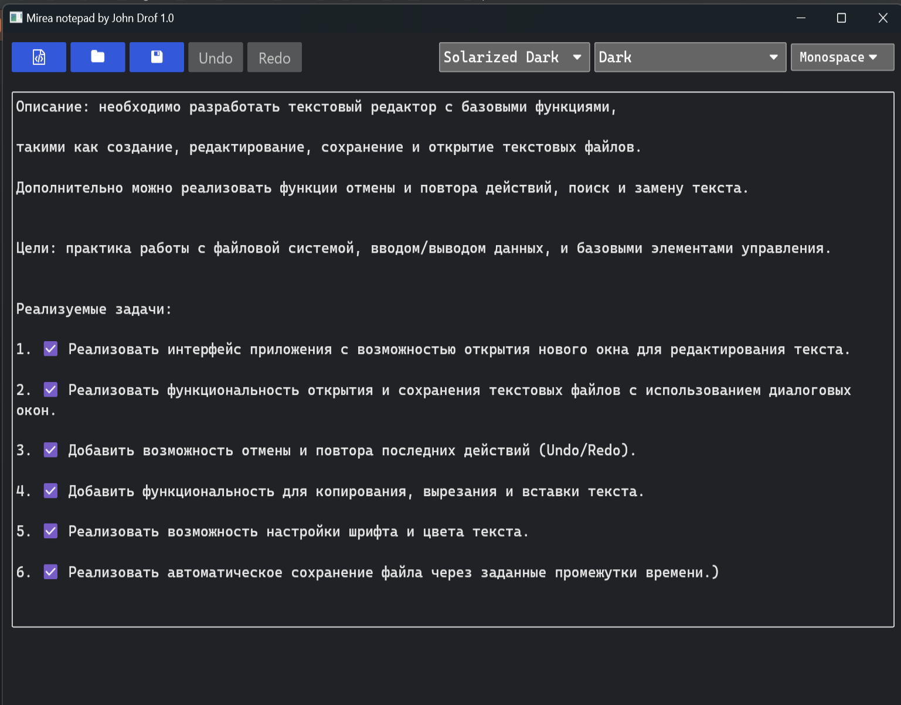
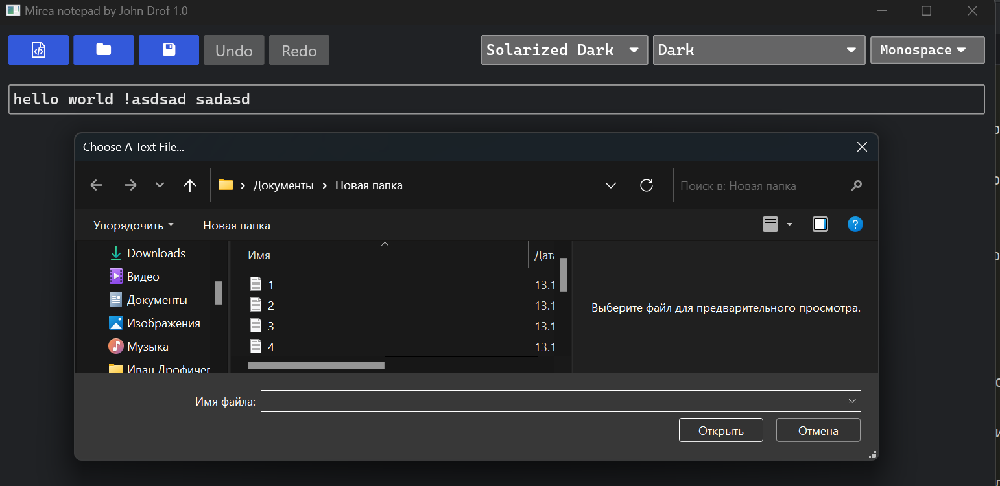
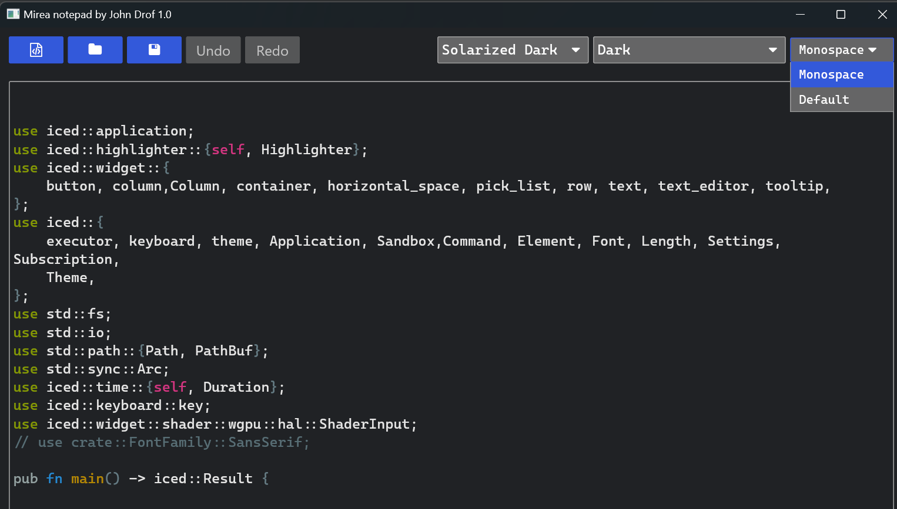

Описание: необходимо разработать текстовый редактор с базовыми функциями, 

такими как создание, редактирование, сохранение и открытие текстовых файлов. 

Дополнительно можно реализовать функции отмены и повтора действий, поиск и замену текста.

Цели: практика работы с файловой системой, вводом/выводом данных, и базовыми элементами управления.

Реализуемые задачи:

1. ☑ Реализовать интерфейс приложения с возможностью открытия нового окна для редактирования текста.

2. ☑ Реализовать функциональность открытия и сохранения текстовых файлов с использованием диалоговых окон.

3. ☑ Добавить возможность отмены и повтора последних действий (Undo/Redo).

4. ☑ Добавить функциональность для копирования, вырезания и вставки текста.

5. ☑ Реализовать возможность настройки шрифта и цвета текста.

6. ☑ Реализовать автоматическое сохранение файла через заданные промежутки времени.)

